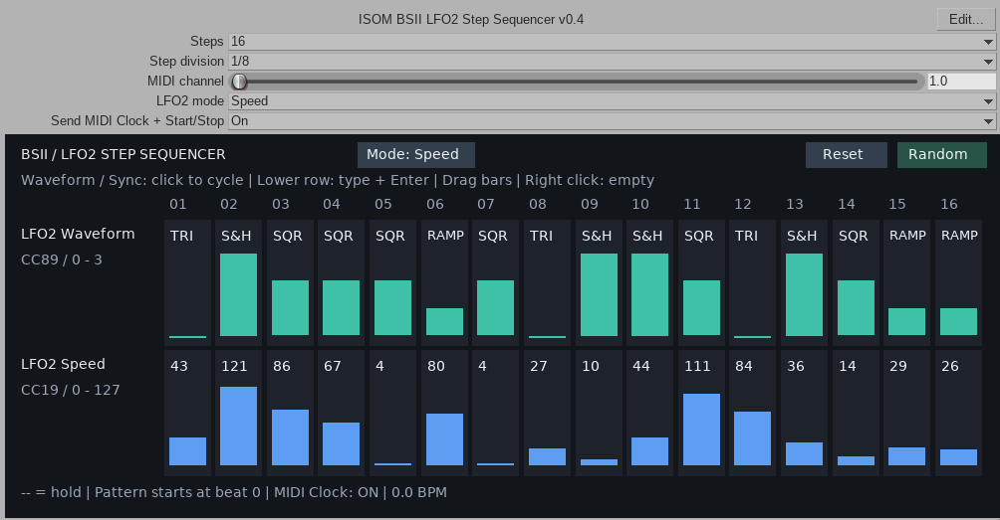

# ISOM Bass Station II LFO2 Sequencer

A MIDI parameter sequencer for the **Novation Bass Station II**, built as a **JSFX plugin for REAPER**. It changes the LFO2 waveform and speed in steps synchronized with the DAW transport. In Sync mode, it selects the LFO rhythmic division instead of its free-running speed. Version: **0.4**.

The plugin controls an external instrument over MIDI. It does not generate audio or notes: play notes from a MIDI item on the same track or from a keyboard. To hear the modulation, set an appropriate LFO2 modulation amount on the Bass Station II, for example its effect on the filter.

## Features

- 8 or 16 steps, looping according to the project position.
- Step duration: 1/4, 1/8, 1/16 or 1/32.
- Two visible rows: waveform and either Speed or Sync.
- Waveforms: TRI, RAMP, SQR, S&H.
- Separate lower-row sequences for Speed and Sync, preserved when switching modes.
- Empty steps that retain the previous parameter value.
- Numeric entry and draggable vertical bars.
- Reset and value randomization with the Random button.
- Optional MIDI Clock and Start/Stop following the REAPER transport.
- Sequences and settings saved in the project and effect preset.

## Requirements

- REAPER with JSFX support; the plugin was developed for use on Linux.
- A Novation Bass Station II connected via USB MIDI or a MIDI interface.
- The MIDI output to the instrument enabled in REAPER.

## Installation

1. In REAPER, select **Options → Show REAPER resource path in explorer/finder**.
2. Open the `Effects` directory and create an `ISOM` subdirectory.
3. Copy `ISOM_BSII_LFO2_Sequencer.jsfx` from this repository into that directory.
4. Restart REAPER. Open the track FX window and search for **ISOM BSII LFO2 Step Sequencer**.

On Ubuntu, the typical location is `~/.config/REAPER/Effects/ISOM/`.

To update, save your project, close REAPER and replace the previous file with the new file of the same name, keeping a backup. Restart REAPER and open your project. Keep the existing effect instance: a new instance starts with empty sequences.

## Getting started

1. In **Preferences → Audio → MIDI Outputs**, enable the output connected to the Bass Station II.
2. Add the plugin to a track. In the track routing window, select that output under **MIDI Hardware Output**.
3. Set the plugin's **MIDI channel** to the instrument's receive channel. If the routing forces a channel, set it to match the instrument as well.
4. Choose **Steps**, **Step division** and **Speed / Sync** mode. Enter values in a few steps.
5. Add MIDI notes or play a keyboard. Press Play in REAPER.
6. To hear the instrument, connect its audio output to your interface and enable monitoring on the corresponding audio track.

The parameter sequencer follows the transport position; the pattern begins at project beat 0. It also runs without a MIDI item containing notes.

### MIDI Clock

**Send MIDI Clock + Start/Stop** is enabled by default. During playback, the plugin sends 24 clock pulses per quarter note at REAPER's tempo. Play sends Start; Stop or pause sends Stop. No clock is sent while stopped.

When the plugin generates the clock, **disable “Send clock to this device” for that MIDI output in REAPER** so the instrument does not receive two clocks. If several plugin instances feed the same instrument, enable clock generation in only one instance. Alternatively, disable the plugin's clock and use REAPER's output clock.

For LFO synchronization, the instrument must use the external MIDI clock. MIDI Clock is independent of the MIDI channel and works in both Speed and Sync modes. Start/Stop messages may also start and stop the hardware arpeggiator or sequencer.

## Editing steps

- **Upper row:** click a waveform name to select the next waveform. You can also drag the bar or press 0–3 in the selected cell.
- **Speed lower row:** click the number field, enter a value from 0–127 and press Enter, or drag the bar.
- **Sync lower row:** click the division name to select the next division. You can also drag the bar or enter an index from 0–34 and press Enter.
- **Empty step (`--`):** right-click a cell or press Delete in the selected cell. No new value is sent; the instrument retains its previous value.
- **Reset:** clears the waveform sequence and both lower-row sequences, including hidden steps 9–16.
- **Random:** randomizes the waveform and the active mode's lower row for all 16 steps. The other mode retains its values. It does not randomize step order or generate empty cells.

**Step division** sets the duration of each sequencer step. The division selected in the **Sync** row sets the LFO period. These settings are independent.

Example Sync indices:

| Entered value | LFO division |
| --- | --- |
| 25 | 1/4 |
| 28 | 1/8 |
| 31 | 1/16 |
| 33 | 1/32 |

In Sync labels, `D` means dotted, `T` means triplet, `bar` means a bar, and `b` indicates a number of quarter-note beats.

## Saving a project

REAPER saves all 48 cells: 16 waveform, 16 Speed and 16 Sync values, including empty and hidden steps. It also saves the slider settings: step count, division, channel, mode and clock enablement. **Press Enter to confirm numeric entries before saving.**

Older v0.2 projects retain their waveform and Speed sequences; the new Sync sequence starts empty. Saved state from v0.3 is compatible with v0.4. Saving the project stores the plugin settings; save the instrument patch separately.

## MIDI messages sent

| Function | Message | Range |
| --- | --- | --- |
| LFO2 Waveform | CC89 | 0–3 |
| LFO2 Speed | CC19 | 0–127 |
| LFO2 Sync division | NRPN 0:91 | 0–34 |
| LFO2 Speed / Sync mode | NRPN 0:92 | 0 = Speed, 1 = Sync |
| Clock | F8 | 24 pulses per quarter note |
| Start / Stop | FA / FC | Follows the transport |

The mode is sent at the start of playback and when the mode or channel changes. A mode change during playback takes effect on the next step. Notes, CC and SysEx pass through the effect. When clock generation is enabled, the plugin's clock and transport replace incoming F8/FA/FB/FC messages.

## Limitations and verification

The clock generator does not send Song Position Pointer. Starting playback from any position sends Start, so the hardware arpeggiator/sequencer starts from its beginning. Looping or seeking during playback repositions the generator without sending Start again. Tempo is read once per audio buffer; continuous tempo ramps are approximated using the current buffer's tempo.

For v0.4, the code structure and clock calculations were checked across 27 combinations of tempo, buffer size and sample rate, with no missing or duplicate pulses. A full v0.4 test in REAPER or on the instrument has not been performed. After installation, check both modes, several tempos, and saving and reopening a project.

The NRPN and division mappings are supported by the [BS2-Web source code](https://github.com/francoisgeorgy/BS2-Web/tree/master/src/bass-station-2). JSFX documentation: [MIDI functions](https://www.reaper.fm/sdk/js/midi.php).

## Video

